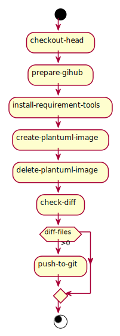

# plantuml-image-auto-commit-example
create and commit plantuml image using github actions

## what is this?
github actions will create plantuml images and push to pull request branch.  
this workflow is useful only pull request.

## workflow diagram

